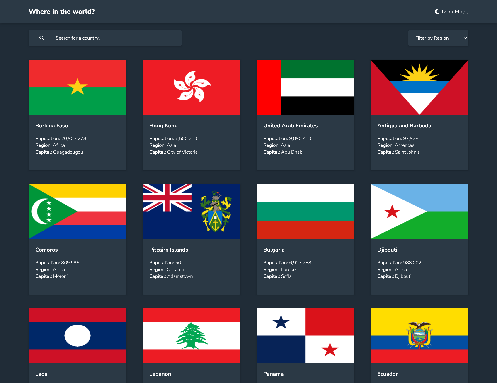

# Frontend Mentor - REST Countries API with color theme switcher solution

This is a solution to the [REST Countries API with color theme switcher challenge on Frontend Mentor](https://www.frontendmentor.io/challenges/rest-countries-api-with-color-theme-switcher-5cacc469fec04111f7b848ca). Frontend Mentor challenges help you improve your coding skills by building realistic projects. 

## Table of contents

- [Overview](#overview)
  - [The challenge](#the-challenge)
  - [Screenshot](#screenshot)
  - [Links](#links)
- [My process](#my-process)
  - [Built with](#built-with)
- [Author](#author)

## Overview

### The challenge

Users should be able to:

- See all countries from the API on the homepage
- Search for a country using an `input` field
- Filter countries by region
- Click on a country to see more detailed information on a separate page
- Click through to the border countries on the detail page
- Toggle the color scheme between light and dark mode *(optional)*

### Screenshot

### Links

- Solution URL: [https://www.frontendmentor.io/solutions/countries-through-rest-api-with-nextjs-A_PQ_M1CVg](https://www.frontendmentor.io/solutions/countries-through-rest-api-with-nextjs-A_PQ_M1CVg)
- Live Site URL: [https://rest-api-countries-bay.vercel.app/](https://rest-api-countries-bay.vercel.app/)

## My process

### Built with

- HTML5
- [Tailwind CSS](https://tailwindcss.com/) - CSS framework
- Flexbox
- Mobile-first workflow
- [React](https://reactjs.org/) - JS library
- [Next.js](https://nextjs.org/) - React framework
- [next-themes](https://github.com/pacocoursey/next-themes) - Next.js plugin
- [tailwindcss-aspect-ratio](https://github.com/tailwindlabs/tailwindcss-aspect-ratio) - Tailwind CSS plugin

## Author

- GitHub - [nooa-p](https://github.com/nooa-p)
- Frontend Mentor - [@nooa-p](https://www.frontendmentor.io/profile/nooa-p)
